## Hey, I'm Nicholas

Brazil-based software engineer. By day I ship PHP / Laravel stacks for
clients; by night I tinker with side projects in Go, Rust, and whatever else
catches my eye.

_Engenheiro de software. De dia entregando stacks PHP / Laravel para clientes; de noite trabalhando com projetos paralelos em Go, Rust, e o que mais chama a minha atenção._

Lately: Rust + wgpu graphics, AI-augmented dev workflows, and porting legacy PHP to Rust and Go.

_Ultimamente: Rust + wgpu, workflows de desenvolvimento com IA, e migrando PHP legado para Rust e Go._

  
  &nbsp;
  

---

[dyrgalla.com](https://dyrgalla.com) · [LinkedIn](https://linkedin.com/in/dyrgalla/) · [n@dyrgalla.com](mailto:n@dyrgalla.com)

Both widgets above are SVGs generated locally — you can copy and run using <code>make</code> to generate for yourself if you want! See <a href="./scripts/"><code>scripts/</code></a>.

<em>Os dois widgets acima são SVGs gerados localmente — pode copiar e rodar usando <code>make</code> para gerar os seus, se quiser! Veja <a href="./scripts/"><code>scripts/</code></a>.</em>
