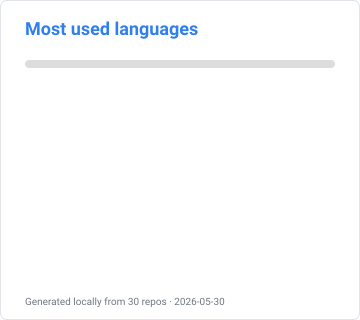

## Hey, I'm Nicholas

I'm a full-stack engineer based in Brazil, and I've been building for the web
since 2003. That's 23 years now. Most of that is PHP and Laravel in production
for clients, plus Go and Rust when a problem actually needs them. Lately I've
been living on Cloudflare's edge: Workers, Pages, and D1.

AI shows up on both sides of my work. I build it into products with LLM APIs and
Workers AI, and I lean on agentic, AI-assisted development to move faster day to
day.

Roughly 3.7k commits across 30 active repos so far. **Open to remote roles
worldwide, and happy to relocate.**

_Sou engenheiro full-stack, moro no Brasil e desenvolvo para a web desde 2003.
Já são 23 anos. A maior parte é PHP e Laravel em produção para clientes, com Go
e Rust quando o problema pede. Ultimamente tenho vivido na borda da Cloudflare:
Workers, Pages e D1._

_IA aparece nos dois lados do meu trabalho. Coloco IA dentro dos produtos, com
APIs de LLM e Workers AI, e me apoio em desenvolvimento assistido por IA para
ir mais rápido no dia a dia._

_Cerca de 3,7 mil commits em 30 repositórios ativos até agora. **Aberto a vagas
remotas no mundo todo, e tranquilo para me mudar.**_

  
  &nbsp;
  

---

[dyrgalla.com](https://dyrgalla.com) · [myfirstllm.com](https://myfirstllm.com) (a free LLM course I wrote) · [muninnstudio.com](https://muninnstudio.com) · [LinkedIn](https://linkedin.com/in/dyrgalla/) · [dyrgalla@pm.me](mailto:dyrgalla@pm.me)

Both widgets above are SVGs generated locally. You can copy and run using <code>make</code> to generate for yourself if you want! See <a href="./scripts/"><code>scripts/</code></a>.

<em>Os dois widgets acima são SVGs gerados localmente. Você pode copiar e rodar usando <code>make</code> para gerar os seus, se quiser! Veja <a href="./scripts/"><code>scripts/</code></a>.</em>
